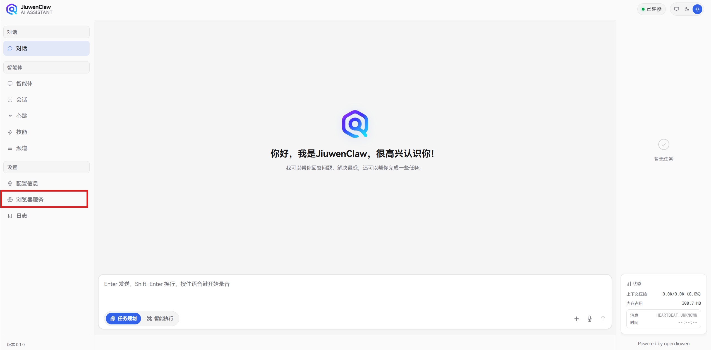
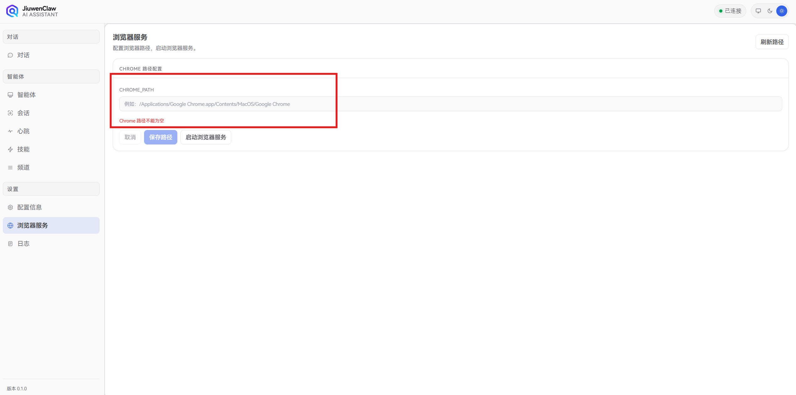
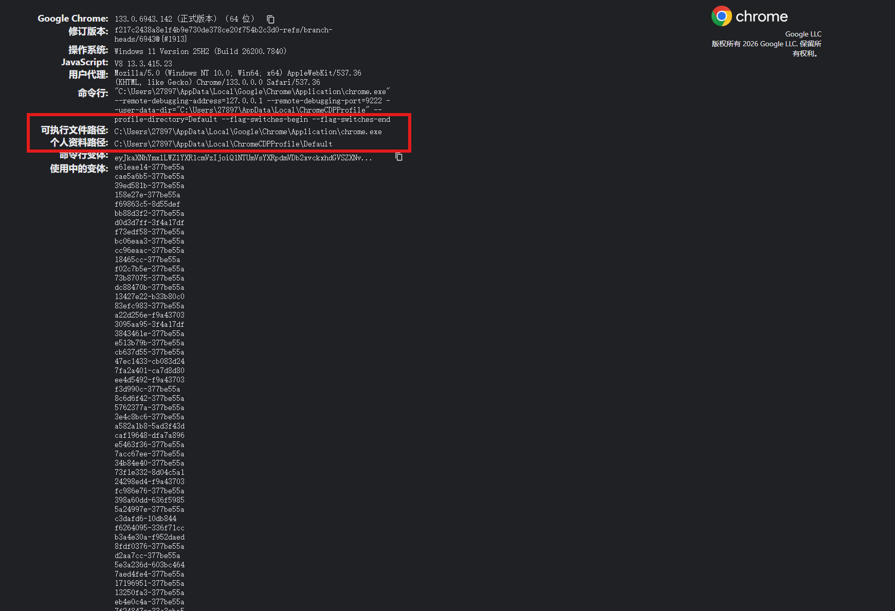

# Browser tools

## 1. Overview

Browser tools drive a real Chrome instance for form filling, clicks, uploads, and web tasks. Configure Chrome in the web UI and start the browser service; the system launches an attachable Chrome instance. When needed, the agent connects and controls it.

## 2. Architecture

- **Web UI**: “Browser service” panel — Chrome path and start/stop.
- **Backend**: `browser_start_client.py` starts local Chrome with remote debugging.
- **Runtime**: Playwright MCP wrapper; tools talk to the runtime via MCP.
- **Agent**: `browser_run_task` turns natural language into browser actions.
- **Sessions**: Browser state is reused per `session_id` (logins, tabs, permissions).

Flow: **UI config → start Chrome → runtime attaches → agent runs tasks**.

## 3. Capabilities

- Open pages and wait for load
- Continue on sites where you are already logged in
- Click, type, select elements
- Multi-step flows
- Reuse one browser session
- Read title, URL, page content
- Forms, attachments, mail, etc.

## 4. Web UI steps

Install Chrome first.

### Step 1: Chrome path and profile

1. Open Chrome.
2. Visit `chrome://version`.
3. Note:
   - **Executable path** → `CHROME_PATH`
   - **Profile path** → confirms user data for login debugging

### Step 2: Open the browser service panel

1. Open the JiuwenClaw web UI.



2. Go to **Settings** → **Browser service**.
3. Find the Chrome path field.



### Step 3: Set `CHROME_PATH`

1. Copy the executable path from `chrome://version`.



2. Paste into **CHROME_PATH** and **Save path**.

### Step 4: Start the browser service

1. Click **Start browser service**.
2. A new Chrome window should open — that instance is controlled by the agent.

### Step 5: Log in manually

For mail, SSO, or intranet, complete login **in that Chrome window** first.

### Step 6: Use from chat

Ask the agent to open pages, fill forms, or continue logged-in flows. It uses the authorized Chrome, not a cold profile.

## 5. Backend configuration

- **`config/config.yaml`**: Chrome launch (path, debugging port, profile).
- **`.env`**: MCP, Playwright, timeouts.

### 5.1 `config/config.yaml`

```yaml
browser:
  chrome_path: "C:\\Users\\YOUR_USER\\AppData\\Local\\Google\\Chrome\\Application\\chrome.exe"
  remote_debugging_address: "127.0.0.1"
  remote_debugging_port: 9222
  user_data_dir: ""
  profile_directory: "Default"
```

- **`chrome_path`**: Executable; can be a string or per-OS map.
- **`remote_debugging_address`**: Usually `127.0.0.1`.
- **`remote_debugging_port`**: Often `9222`.
- **`user_data_dir`**: Empty uses OS default.
- **`profile_directory`**: Often `Default`.

Per-OS example:

```yaml
browser:
  chrome_path:
    windows: "C:\\Users\\YOUR_USER\\AppData\\Local\\Google\\Chrome\\Application\\chrome.exe"
    macos: "/Applications/Google Chrome.app"
    linux: "/usr/bin/google-chrome"
  remote_debugging_address: "127.0.0.1"
  remote_debugging_port: 9222
  user_data_dir: ""
  profile_directory: "Default"
```

### 5.2 `.env` — browser runtime

#### A. Browser MCP wrapper

```dotenv
BROWSER_RUNTIME_MCP_ENABLED=1
BROWSER_RUNTIME_MCP_CLIENT_TYPE=streamable-http
BROWSER_RUNTIME_MCP_SERVER_ID=playwright_runtime_wrapper
BROWSER_RUNTIME_MCP_SERVER_NAME=playwright-runtime-wrapper
BROWSER_RUNTIME_MCP_SERVER_PATH=http://127.0.0.1:8940/mcp
BROWSER_RUNTIME_MCP_TIMEOUT_S=300
BROWSER_RUNTIME_MCP_HOST=127.0.0.1
BROWSER_RUNTIME_MCP_PORT=8940
BROWSER_RUNTIME_MCP_PATH=/mcp
BROWSER_RUNTIME_MCP_COMMAND=
BROWSER_RUNTIME_MCP_ARGS=
BROWSER_RUNTIME_MCP_AUTO_SSE_FALLBACK=1
```

#### B. Official Playwright MCP

```dotenv
PLAYWRIGHT_MCP_COMMAND=npx
PLAYWRIGHT_MCP_ARGS=-y @playwright/mcp@latest
PLAYWRIGHT_CDP_URL=http://127.0.0.1:9222
```

`PLAYWRIGHT_CDP_URL` must match `config.yaml` debugging host/port.

#### C. Timeouts

```dotenv
PLAYWRIGHT_TOOL_TIMEOUT_S=300
BROWSER_TIMEOUT_S=300
BROWSER_ALLOW_SHORT_TIMEOUT_OVERRIDE=0
```

### 5.3 Minimal recommended setup

`config/config.yaml`:

```yaml
browser:
  chrome_path: "C:\\Users\\YOUR_USER\\AppData\\Local\\Google\\Chrome\\Application\\chrome.exe"
  remote_debugging_address: "127.0.0.1"
  remote_debugging_port: 9222
  user_data_dir: ""
  profile_directory: "Default"
```

`.env`:

```dotenv
BROWSER_RUNTIME_MCP_ENABLED=1
BROWSER_RUNTIME_MCP_CLIENT_TYPE=streamable-http
BROWSER_RUNTIME_MCP_SERVER_PATH=http://127.0.0.1:8940/mcp
PLAYWRIGHT_MCP_COMMAND=npx
PLAYWRIGHT_MCP_ARGS=-y @playwright/mcp@latest
PLAYWRIGHT_CDP_URL=http://127.0.0.1:9222
PLAYWRIGHT_TOOL_TIMEOUT_S=300
BROWSER_TIMEOUT_S=300
BROWSER_ALLOW_SHORT_TIMEOUT_OVERRIDE=0
```

## 6. Tips

- Prefer a real local Chrome install.
- **Log in** in the launched window before heavy automation.
- Keep one session for long flows.
- **Align `PLAYWRIGHT_CDP_URL`** with `config.yaml` debugging settings.
- Keep **`BROWSER_ALLOW_SHORT_TIMEOUT_OVERRIDE=0`** so the model cannot shorten timeouts too aggressively.

## 7. Code index

### Frontend
- `jiuwenclaw/web/src/components/BrowserPanel/index.tsx` — path, save, start service.

### Backend
- `app.py` — `path.get`, `path.set`, `browser.start`, etc.
- `jiuwenclaw/agentserver/tools/browser_start_client.py` — Chrome launch from `config.yaml`.
- `jiuwenclaw/agentserver/tools/browser_tools.py` — MCP client, auto-start wrapper.
- `jiuwenclaw/agentserver/tools/browser-move/src/playwright_runtime_mcp_server.py` — MCP server.
- `.../playwright_runtime/runtime.py`, `service.py`, `agents.py`, `config.py` — runtime orchestration.

### Config
- `config/config.yaml`, `.env`, `.env.template`

## 8. Summary

Browser tools let the agent run **in your authenticated Chrome**: the UI configures and starts Chrome; the backend attaches and automates via Playwright MCP.
