# Channels — unified chat hub

**Channels** are how JiuwenClaw connects to chat platforms. **HarmonyOS Xiaoyi**, **Feishu (Lark)**, and more are supported, with more coming. You can talk to JiuwenClaw from **Feishu**, **Xiaoyi on Harmony devices**, and others.

## Digital Avatar

JiuwenClaw supports **Group Digital Avatar** on **Feishu** and **WeCom** channels. When enabled, the bot acts as a designated user's "digital avatar" in group chats — it automatically identifies messages relevant to that user and replies on their behalf in first person. For personal action items such as to-dos and reminders, the avatar sends the reply as a private message to the user while posting a brief confirmation in the group. Irrelevant messages are filtered out automatically, saving Agent resources.

This feature is disabled by default. See the configuration instructions under each channel below.

Configure channels in either of two ways:

* **Web UI (recommended)** — In the app, open **Agent** / **Channels**, then fill in the channel form.

* **Edit `config.yaml` manually** — Usually `~/.jiuwenclaw/config/config.yaml` (created on first `jiuwenclaw-start`). Set `enabled: true` and credentials; save to auto-reload without a full restart.

  

# Xiaoyi

[Demo video](../assets/videos/xiaoyi_channel.mp4)

## 1. Create a Xiaoyi agent

Create a **JiuwenClaw-mode** agent on the [Xiaoyi Open Platform](https://developer.huawei.com/consumer/cn/hag/abilityportal/#/) to connect to your JiuwenClaw service.


Step 1: create a JiuwenClaw-mode agent.


Step 2: create credentials and whitelist

Create credentials and **save the AK and SK**.


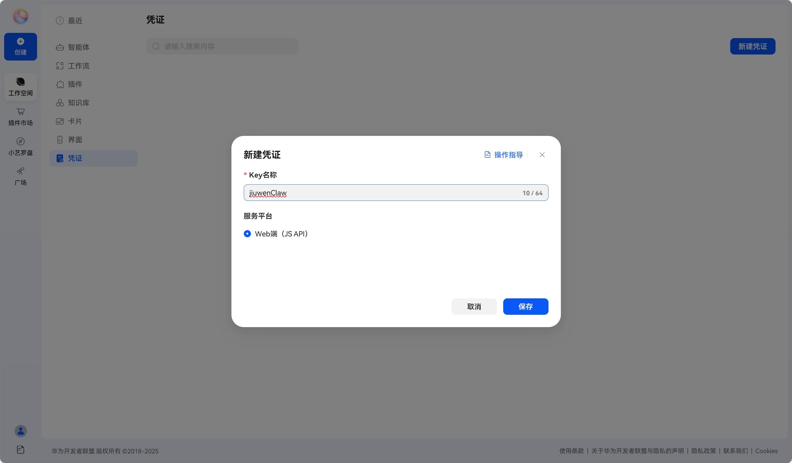


The platform supports on-device debugging: add users to a whitelist group to test on Harmony devices. After approval and publishing, the agent appears in the Xiaoyi app.


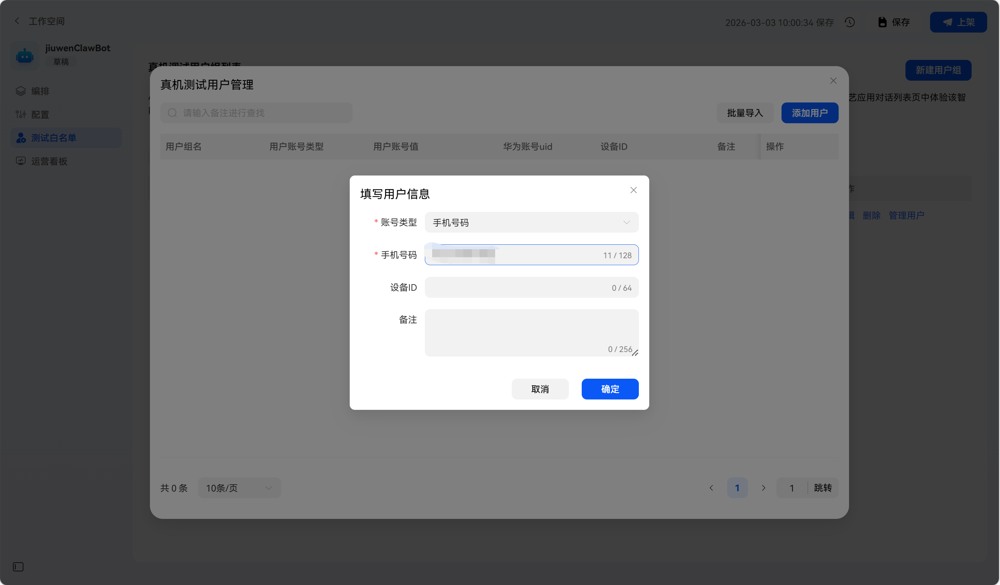

Select the new user group.

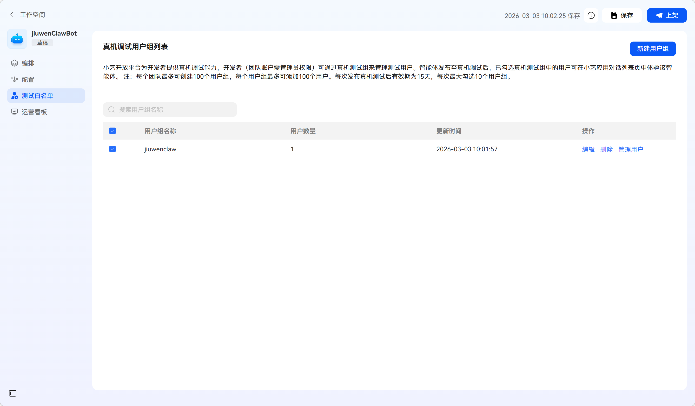

Step 3: publish

Fill in the opening lines and click publish.


## 2. Bind the channel

**Option A**: Paste **AK**, **SK**, and **agentId** from the platform into the Xiaoyi channel in JiuwenClaw, enable, and save.


**Option B**: Edit `~/.jiuwenclaw/config/config.yaml`:

``````
channels:
  xiaoyi:
    # Huawei Xiaoyi A2A
    ak: "<ak from platform>"
    sk: "<sk from platform>"
    agent_id: "<your agent id>"
    enable_streaming: true
    enabled: true
``````

If the service is already running it reloads; otherwise run `jiuwenclaw-start`.

## 3. Chat

Option 1: Web UI.


Option 2: On a Harmony phone, open the published agent in the Xiaoyi app.


# Feishu (Lark)

## 1. Create a Feishu custom app
1. Open [Feishu Open Platform](https://open.feishu.cn/) and sign in.

2. In the developer console, **Create custom app**.

3. Set name, description, icon, and create.

   

## 2. Add bot capability
1. In the app, open **Add capability**.

2. Under **Bot**, click **Add**.

   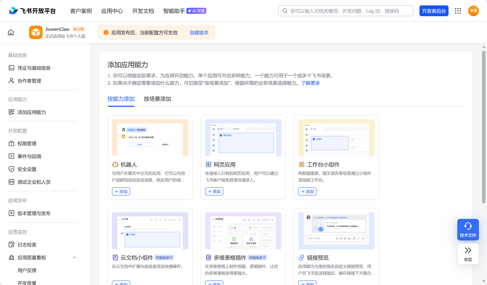

## 3. Save app credentials
1. Open the Feishu bot admin.

2. Copy **App ID** and **App Secret** into JiuwenClaw’s Feishu channel, enable, and save.

   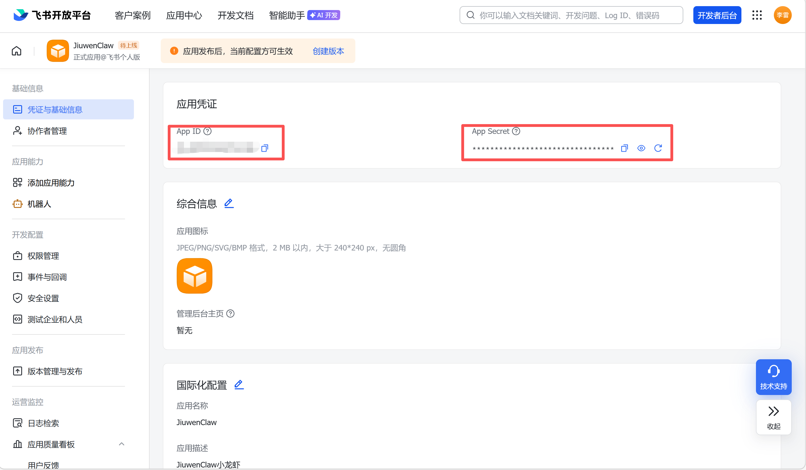

   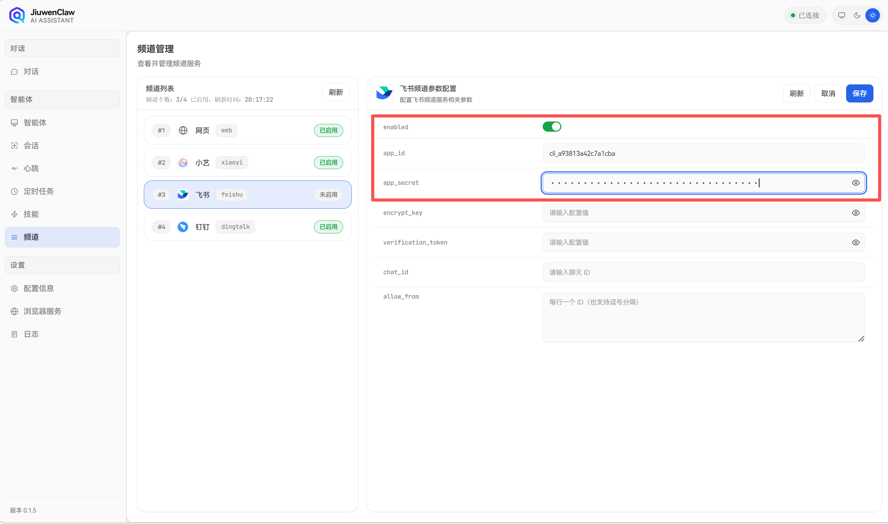

## 4. Permissions
1. **Permission management** → **API permissions**.
2. Enable at least:
   - `im:message` (send/receive as app, DMs, group @mentions).
   - `im:resource` (upload images/files).
   - `contact:user.employee_id:readonly` (user IDs).
   - Or import a preset bundle from Volcengine docs.

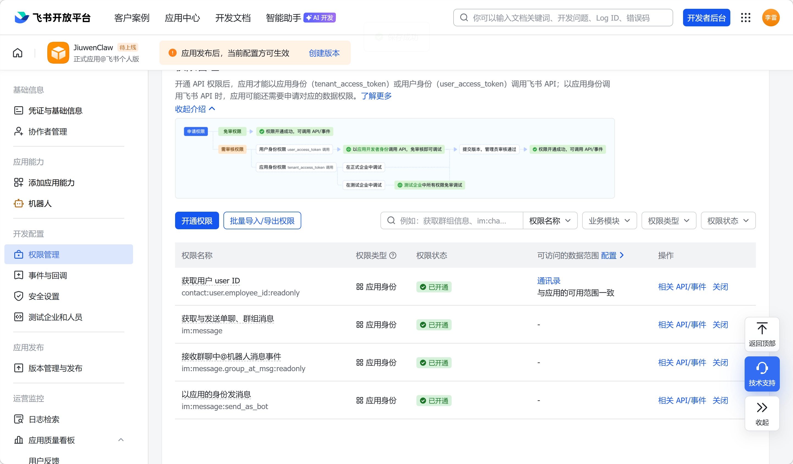

## 5. Event subscription
1. **Events & callbacks**.
2. **Add events**:
   - `im.message.receive_v1`
   - `im.message.message_read_v1` (optional)
3. **Add trigger**：
   - `card.action.trigger`
4. If encryption is on, save **Encrypt Key**.

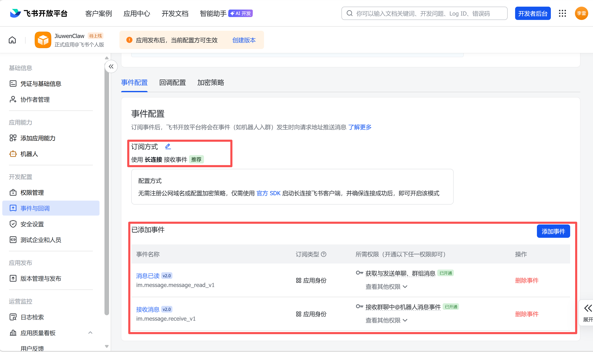

## 6. Publish
1. **Version & release** → **Create version**.
2. Set version notes and visibility (often **All members**).
3. Submit. If review is off, it goes live immediately.
4. In the Feishu app, sign in as the submitter to see the bot.


## 7. Add bot to a group (optional)
1. Open the target group in Feishu.
2. **Group settings** → **Group bots** → **Add bot**, search your app name.


## 8. Enable Feishu channel in JiuwenClaw
Start the web UI, open **Channels → Feishu**, enable, and paste **App ID** and **App Secret**.

## 9. Enable Group Digital Avatar (optional)

After completing the basic Feishu bot setup, you can enable the digital avatar feature so the bot automatically replies in group chats on behalf of a designated user.

> In Feishu, the digital avatar responds when someone **@mentions the bot**, **@mentions the represented user**, or **mentions the user's name** in the message text.

### Prerequisites

- Feishu bot has been created, published, and added to the target group (see step 7)

### Configuration steps

1. In the JiuwenClaw channel management page, open the Feishu channel settings and enable the **`group_digital_avatar`** toggle. Configure **`my_user_id`** and **`bot_name`**.

   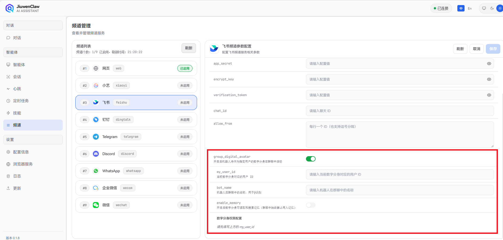

2. Set **`my_user_id`** (required): the Feishu `open_id` of the user this avatar represents. To obtain it:
   - Sign in to the Feishu API Explorer, open the [Send Message API](https://open.feishu.cn/document/server-docs/im-v1/message/create)
   - Set `receive_id_type` to **open_id**
   - Click **Quick copy open_id**, select the target user — the copied value is `my_user_id`

   

   

3. Set **`bot_name`**: the bot's display name in the group, used for @mention detection.

4. (Optional) Enable **`enable_memory`** to let the bot read and search local memory files in group chats.

5. **Configure tool / path permissions**: the digital avatar operates autonomously in group chats and cannot prompt the user for confirmation like in DMs. You must pre-configure which tools are allowed and which paths are accessible. After enabling the avatar, open the permission settings and set each tool's permission (`allow` / `deny`). Without explicit configuration, any operation that would require confirmation (`ask`) is automatically downgraded to `deny`.

   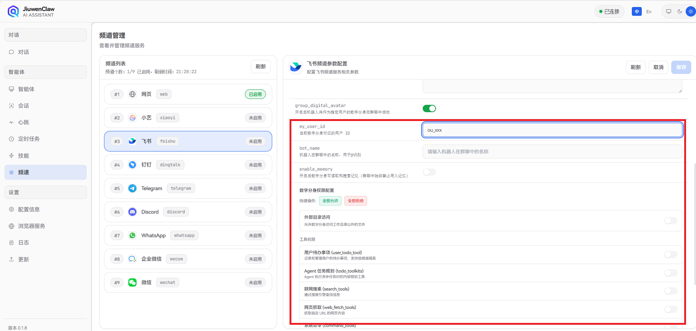

You can also configure via `~/.jiuwenclaw/config/config.yaml`:

``````
channels:
  feishu:
    app_id: "your App ID"
    app_secret: "your App Secret"
    enabled: true
    # Group digital avatar
    group_digital_avatar: true
    my_user_id: "ou_xxxx"       # Feishu open_id of the represented user
    bot_name: "bot name"        # Bot display name in the group
    enable_memory: false         # Enable group chat memory

# Digital avatar tool permissions (scoped by channel_id + user_id)
permissions:
  owner_scopes:
    feishu:
      "ou_xxxx":                 # Must match my_user_id above
        defaults:
          "*": "allow"           # Global default: allow / deny
        tools:
          bash:
            "*": "deny"          # Deny bash by default
            patterns:
              "git status *": "allow"
              "git log *": "allow"
          write:
            "*": "deny"
  deny_guidance_message: "This tool is not authorized in digital avatar mode."
``````

6. The Feishu robot needs to be granted the following permissions：
  im:message.group_msg - Retrieve all messages in the group (with sensitive permissions)
  contact:contact.base:readonly - Retrieve basic information of the contact list
  contact:user.base:readonly - Retrieve basic information of the user

### Fields

| Field | Description |
|:------|:------------|
| `group_digital_avatar` | Enable group digital avatar. When on, the bot acts as the designated user's avatar in group chats — it filters irrelevant messages, rewrites relevant ones, and routes personal action replies (to-dos, reminders) as private messages while posting a brief confirmation in the group |
| `my_user_id` | **Required** when avatar is on: the Feishu `open_id` (e.g. `ou_xxx`) of the represented user. Avatar does not work without this |
| `bot_name` | Bot display name in the group, used for @mention detection |
| `enable_memory` | Enable group chat memory. When on, the bot can read and search local memory files in group chats |
| `owner_scopes` | Tool permissions scoped by `channel_id` + `user_id`. Supports `allow` / `deny`; `ask` is automatically downgraded to `deny` in avatar mode. Web UI configuration is recommended |

## 10. Multiple Feishu bots (`feishu_enterprise`)

Use `channels.feishu_enterprise` when one JiuwenClaw instance must serve **multiple Feishu apps** (multiple bots).

Each bot is a separate channel; `channel_id` looks like `feishu_enterprise:<app_id>`.

Configure only via `~/.jiuwenclaw/config/config.yaml`:

``````
channels:
  feishu_enterprise:
    bot_a:
      app_id: "cli_xxx"
      app_secret: "xxx"
      encrypt_key: ""
      verification_token: ""
      allow_from: []
      enable_streaming: true
      chat_id: ""
      enabled: true
    bot_b:
      app_id: "cli_yyy"
      app_secret: "yyy"
      encrypt_key: ""
      verification_token: ""
      allow_from: []
      enable_streaming: true
      chat_id: ""
      enabled: true
``````

### Fields

| Field | Description |
|:------|:------------|
| `app_id` | Feishu App ID (required) |
| `app_secret` | Feishu App Secret (required) |
| `encrypt_key` | Event encryption key (optional) |
| `verification_token` | Event verification token (optional) |
| `allow_from` | Allowed user `open_id` list; empty = no filter |
| `enable_streaming` | Stream assistant output |
| `chat_id` | Fixed push target (optional) |
| `enabled` | Enable this bot |

### vs single `feishu`

- `feishu`: one channel, `channel_id` is always `feishu`.
- `feishu_enterprise`: multiple channels, one per bot (`feishu_enterprise:<app_id>`).
- Session state is tracked per bot so bots do not overwrite each other.

# DingTalk

## 1. Prerequisites

- Your account must be an **enterprise admin** or have **developer permissions**.
- The org must have **DingTalk Open Platform** enabled.

## 2. Create an internal app bot

### Step 1: Open the console

- Visit [https://open-dev.dingtalk.com](https://open-dev.dingtalk.com)
- **App development** → **Internal org apps** → **Create app**


### Step 2: App info

- Name, e.g. `JiuwenClaw`
- Type: **Bot**


### Step 3: Enable bot

- Open the app → **Capabilities** → **Bot** → configure name and short intro.

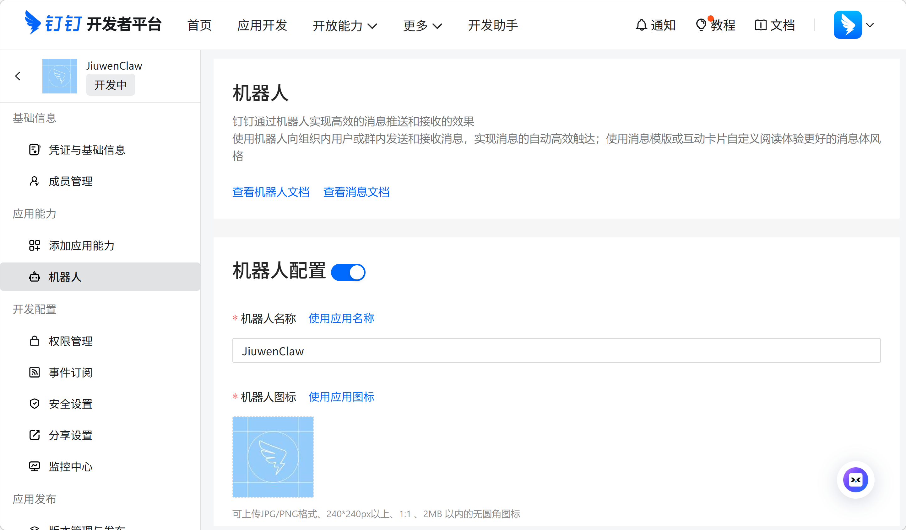

### Step 4: Message mode

Choose **Stream mode** (WebSocket long connection) — no public IP required; good for cloud functions or local dev.


## 3. Permissions

Under **Permissions**, enable as needed, e.g.:

- Send DM/group messages: `qyapi_robot_sendmsg`
- Lookup user by mobile: `topapi_v2_user_getbymobile`
- Interactive cards: `Card.Instance.Write`
- Streaming cards: `Card.Streaming.Write`

## 4. Publish

### Step 1: Save and publish

- Save bot settings.
- **Version & publish** → publish with notes and scope.


### Step 2: Confirm

- After **Published**, the bot can be used in DingTalk.

> After publishing, search the bot name in DingTalk to add it to chats.


## 5. Configure DingTalk in JiuwenClaw

Copy **Client ID** and **Client Secret** from **Credentials**.

In JiuwenClaw **Channels → DingTalk**, enable and paste **client_id** / **client_secret**, then save.


# WeCom (WeChat Work)

## 1. Create a bot in WeCom

1. Open WeCom → **Workbench** → **Smart bot** → **Create bot** → **Manual creation**

   

   

   

2. Choose **API mode**.

   

3. Set connection to **Long connection**.

   

4. After creation, save **Bot ID** and **Secret** for JiuwenClaw.

## 2. Link JiuwenClaw

1. In JiuwenClaw, open **Channels** → **WeCom**.

2. Enter **bot id** and **secret**, then save.

   

   

## 3. Chat with the bot

> If you cannot find the bot: **Workbench → Smart bot → Details → Use → Send message**.


1. On PC WeCom, send a test message; a reply means success.

2. On mobile WeCom, do the same.


## 4. Enable Group Digital Avatar (optional)

After completing the basic WeCom bot setup, you can enable the digital avatar feature.

> ⚠️ **Note**: In WeCom, group messages must **@mention the bot** for the bot to receive them. Messages that do not @mention the bot will not trigger the digital avatar.

### Prerequisites

- WeCom bot has been created and linked to JiuwenClaw
- Bot has been added to the target group: open WeCom, enter the group, tap add member → **Group bots** → **Smart bot**, and search for your app

### Configuration steps

1. In the JiuwenClaw channel management page, open the WeCom channel settings and enable the **`group_digital_avatar`** toggle. Configure **`my_user_id`** and **`bot_name`**.

   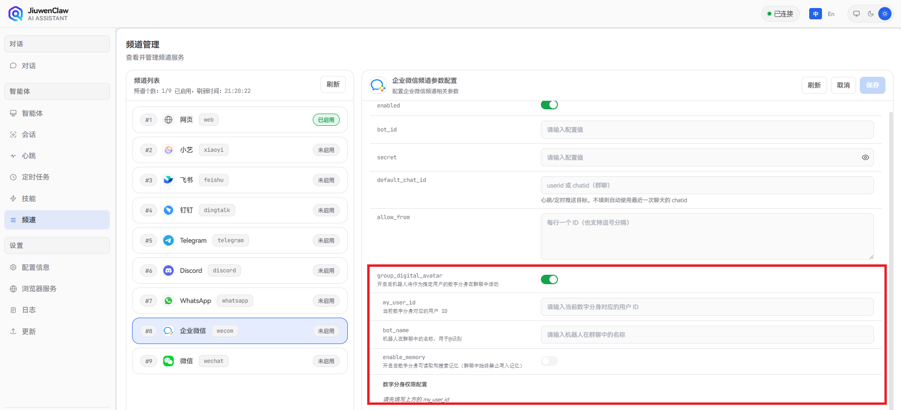

2. Set **`my_user_id`** (required): the WeCom account of the user this avatar represents. To obtain it:
   - Open the [WeCom Admin Console](https://work.weixin.qq.com/wework_admin/login)
   - Go to **Contacts → Organization → Department → Member details**
   - The **Account** field is the `my_user_id`

   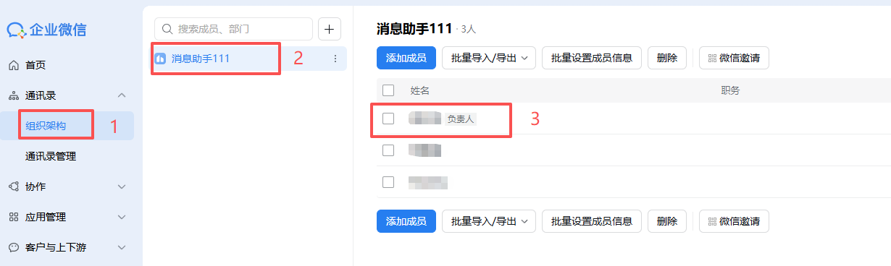

   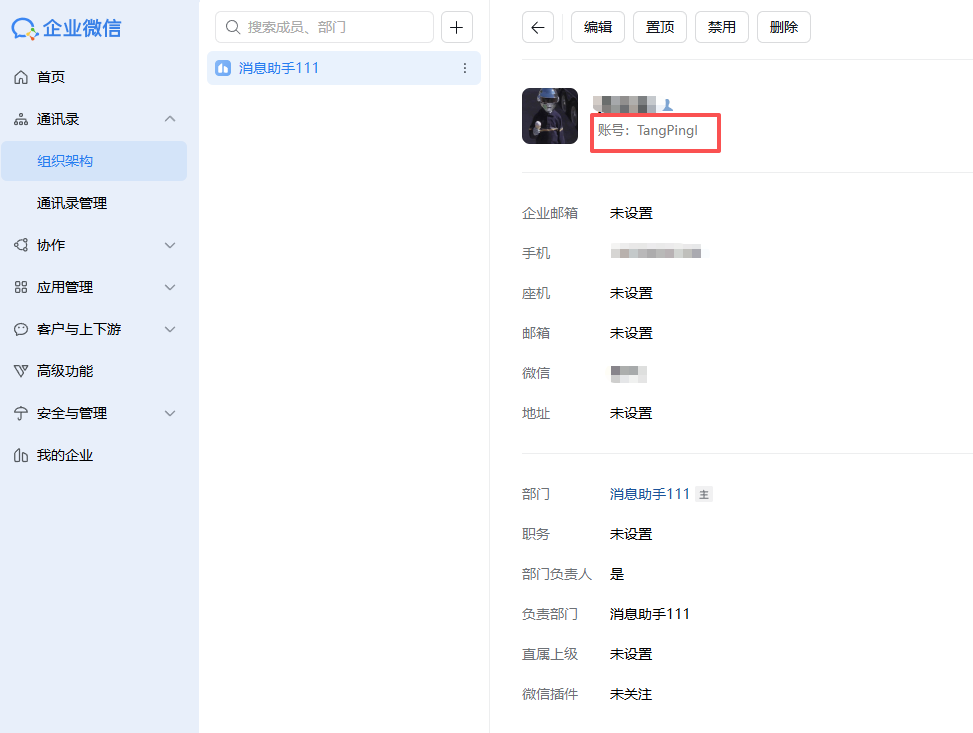

3. Set **`bot_name`** (optional): the bot's display name in the group, used for @mention detection.

4. (Optional) Enable **`enable_memory`** to let the bot read and search local memory files in group chats (memory is not written in group chats).

5. **Configure tool / path permissions**: the digital avatar operates autonomously in group chats and cannot prompt the user for confirmation like in DMs. You must pre-configure which tools are allowed and which paths are accessible. After enabling the avatar, open the permission settings and set each tool's permission (`allow` / `deny`). Without explicit configuration, any operation that would require confirmation (`ask`) is automatically downgraded to `deny`.

   

You can also configure via `~/.jiuwenclaw/config/config.yaml`:

``````
channels:
  wecom:
    bot_id: "your Bot ID"
    secret: "your Secret"
    enabled: true
    # Group digital avatar
    group_digital_avatar: true
    my_user_id: "account"        # WeCom account of the represented user
    bot_name: "bot name"         # Bot display name in the group (optional)
    enable_memory: false          # Enable group chat memory

# Digital avatar tool permissions (scoped by channel_id + user_id)
permissions:
  owner_scopes:
    wecom:
      "account":                  # Must match my_user_id above
        defaults:
          "*": "allow"           # Global default: allow / deny
        tools:
          bash:
            "*": "deny"
            patterns:
              "git status *": "allow"
              "git log *": "allow"
          write:
            "*": "deny"
  deny_guidance_message: "This tool is not authorized in digital avatar mode."
``````

### Fields

| Field | Description |
|:------|:------------|
| `group_digital_avatar` | Enable group digital avatar. When on, the bot acts as the designated user's avatar in group chats — it filters irrelevant messages, rewrites relevant ones, and routes personal action replies (to-dos, reminders) as private messages while posting a brief confirmation in the group |
| `my_user_id` | **Required** when avatar is on: the WeCom account of the represented user. Avatar does not work without this |
| `bot_name` | Optional: bot display name in the group, used for @mention detection |
| `enable_memory` | Enable group chat memory. When on, the bot can read and search local memory files in group chats; memory is not written in group chats |
| `owner_scopes` | Tool permissions scoped by `channel_id` + `user_id`. Supports `allow` / `deny`; `ask` is automatically downgraded to `deny` in avatar mode. Web UI configuration is recommended |

# Telegram

## 1. Create a bot

Use [@BotFather](https://t.me/BotFather) to create a bot and get a **Bot Token**.

Step 1: open `@BotFather`.


Step 2: send `/newbot` and follow prompts.

You will set:

- **Display name** (e.g. `JiuwenClaw Bot`)
- **Username** (must end with `bot`, e.g. `jiuwenclaw_bot`)

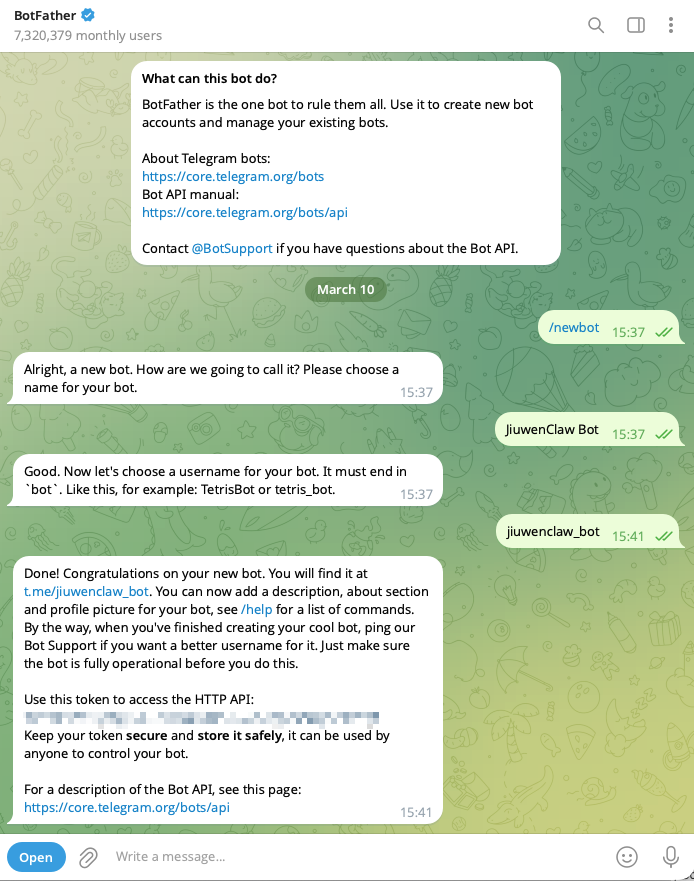

Step 3: **Save the token** (format like `123456789:ABCDefGhIJKlmN...`).

> The token is a password for the bot — do not leak it. Use `/revoke` in BotFather if exposed.

## 2. Bind the channel

**Option A: Web UI**

Open **Agent / Channels** → Telegram, paste **Bot Token**, enable, save.

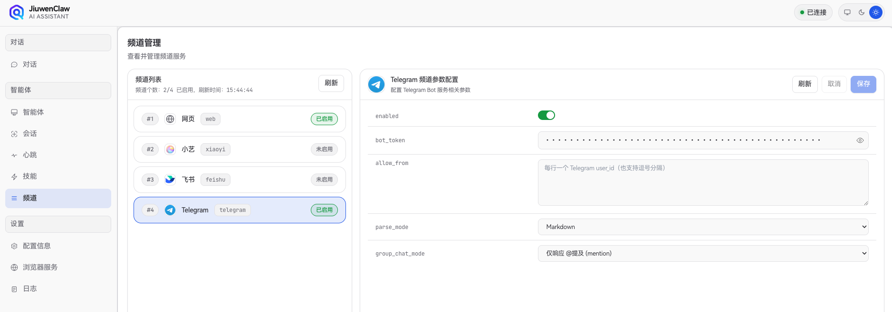

**Option B: `config.yaml`**

Edit `~/.jiuwenclaw/config/config.yaml`:

``````
channels:
  telegram:
    bot_token: "<token from BotFather>"
    allow_from: []
    parse_mode: Markdown
    group_chat_mode: mention
    enabled: true
``````

Reload or start `jiuwenclaw-start`.

## 3. Options

| Field | Description | Default |
|:------|:------------|:--------|
| `bot_token` | Bot token from BotFather (**required**) | empty |
| `allow_from` | Allowed Telegram `user_id` list; empty = everyone | `[]` |
| `parse_mode` | `Markdown`, `HTML`, or `None` | `Markdown` |
| `group_chat_mode` | See below | `mention` |
| `enabled` | Enable Telegram | `false` |

### Group modes

| Mode | Behavior |
|:-----|:---------|
| `mention` | Only when the bot is @mentioned (recommended) |
| `reply` | Only when replying to the bot |
| `all` | All text messages in the group |
| `off` | Ignore group messages |

## 4. Start chatting

DM the bot or add it to a group per `group_chat_mode`.


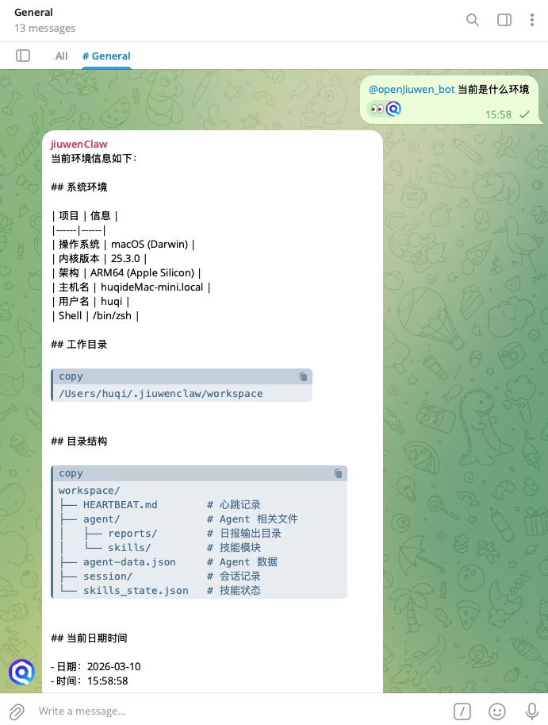

## 5. Find `user_id` (allowlist)

1. Message `@userinfobot` to get your id.
2. Put ids in `allow_from`:

``````
channels:
  telegram:
    bot_token: "<token>"
    allow_from:
      - "123456789"
      - "987654321"
    enabled: true
``````

> Empty `allow_from` allows everyone; non-empty restricts to listed users.

# Discord

Discord is supported. Configure in **Channel management** or edit `config.yaml`.

**Step-by-step guide** (Developer Portal, intents, install link, channel management): see [Discord.md](Discord.md).

- `bot_token`
- `application_id`
- `guild_id`
- `channel_id`
- `allow_from`
- `enabled`

Example `~/.jiuwenclaw/config/config.yaml`:

``````
channels:
  discord:
    bot_token: "Discord Bot Token"
    application_id: "Application ID"
    guild_id: "Guild ID"
    channel_id: "Channel ID"
    allow_from: []
    enabled: false
``````

## Usage

1. Create a bot in the Discord Developer Portal; copy `bot_token`.
2. Enable **Message Content Intent** for the bot.
3. Invite the bot to the server with channel permissions.
4. Fill JiuwenClaw and set `enabled: true`.

## Fields

| Field | Description |
|:------|:------------|
| `bot_token` | Discord bot token (required) |
| `application_id` | Application id (optional, recommended) |
| `guild_id` | Limit to one server (optional; empty = any) |
| `channel_id` | Limit listen/reply to one channel (optional) |
| `allow_from` | Allowed Discord user ids; empty = all |
| `enabled` | Enable Discord channel |

# Personal WeChat

## 1. Prerequisites

- You are an **Android** or **iOS** user.
- Or, you are a **HarmonyOS** user and can use **ZhuoYiTong**.

## 2. Android / iOS Setup

### Step 1: Upgrade WeChat

- In WeChat, go to **Me** -> **Settings** -> **About WeChat** -> **Version Update**：
   - iOS upgrade to the latest `8.0.70` version.
   - Android upgrade to the latest `8.0.69` version.


### Step 2: Connect via WeChat QR Scan

- In the latest JiuwenClaw frontend, go to **Channels** -> **WeChat**, enable WeChat configuration, and click **Save**. A QR code will be displayed.


- On your phone, open WeChat and go to **+** -> **Start Scanning**, scan the QR code generated in the previous step to finish the connection.


## 3. HarmonyOS Setup

Native HarmonyOS WeChat does not currently support **ClawBot**. You can still connect through **ZhuoYiTong** as follows:

### Step 1: Install WeChat Dual-App

- Download and install **WeifenShen Dual-App** via **ZhuoYiTong**, then sign in to WeChat again.


### Step 2: Upgrade and Connect

- Follow the same upgrade and connection steps as in **Android / iOS Setup**.
