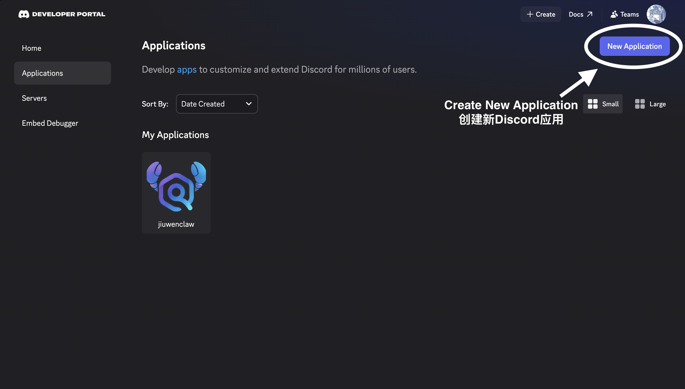
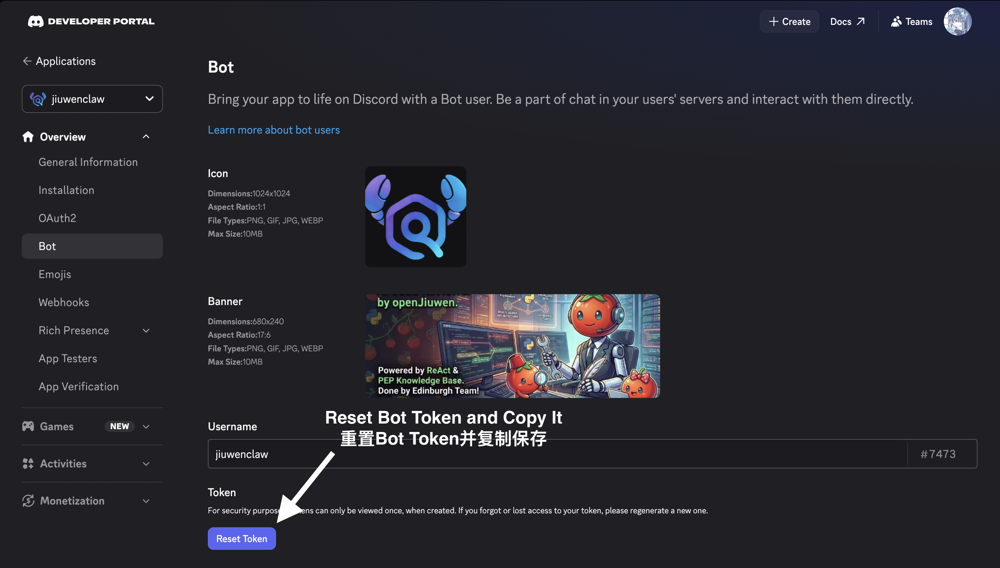
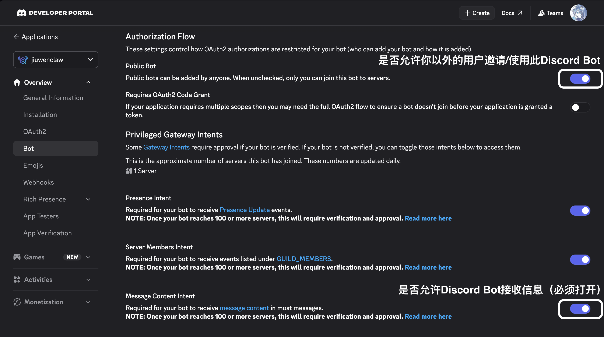
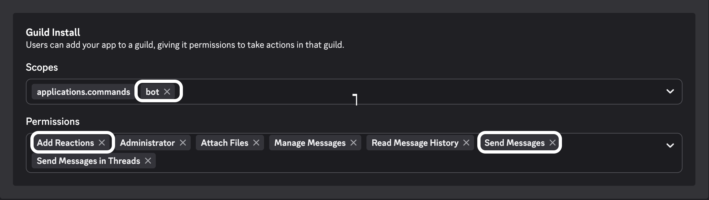
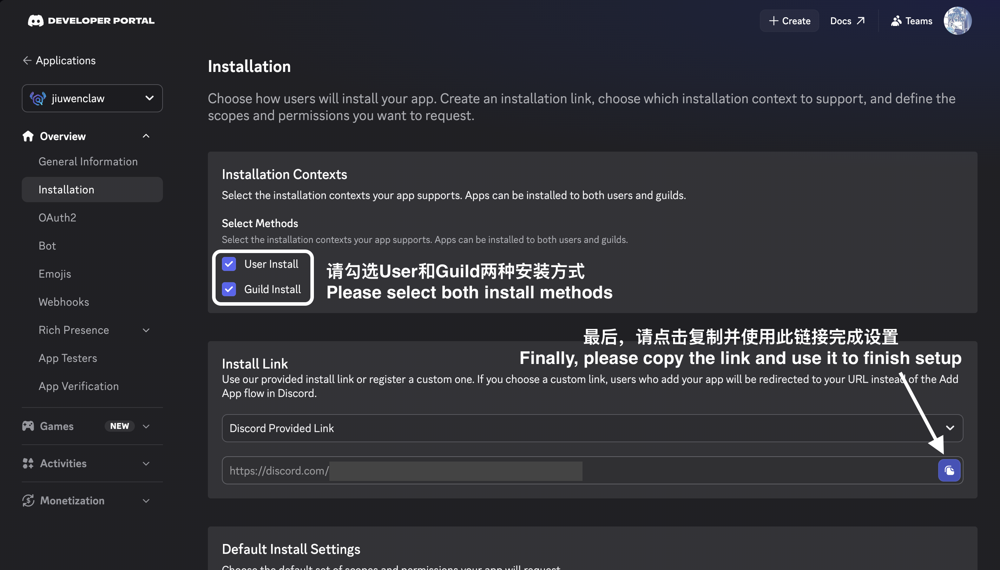

# Discord Channel Setup

This guide walks through creating a Discord application and bot in the [Discord Developer Portal](https://discord.com/developers/applications), enabling the intents and install options JiuwenClaw needs, and wiring the bot into **Channel Management** in JiuwenClaw.

## What This Repo Uses

- Python channel: `jiuwenclaw/channel/discord_channel.py` (discord.py)
- Runtime config: `channels/discord` in your `config.yaml` (or the web UI **Channel Management** → Discord)

The bot connects with your **Bot Token**, receives messages in configured guild channels and/or DMs (unless you turn off DMs), and can add a 👀 reaction while processing, similar to other channels.

## Prerequisites

- A Discord account
- Permission to add bots to a server (or users can install the app for DMs, depending on your install settings)

---

## 1. Create an application

1. Open [https://discord.com/developers/applications](https://discord.com/developers/applications).
2. Click **New Application**, choose a name, and create it.



You will use this application for both **OAuth2 / installation** and the **Bot** user.

---

## 2. Get the Bot Token (reset and copy)

1. In the left sidebar, open **Bot**.
2. Under **Token**, use **Reset Token** and confirm.
3. **Copy the token immediately** and store it somewhere safe. Discord shows it only once after a reset.



**Security**

- Treat the token like a password. Anyone with it can control your bot.
- Paste it into JiuwenClaw’s Discord settings or `config.yaml`; do not commit it to git.
- If it leaks, reset the token again in the same place.

You will map this value to **`bot_token`** in JiuwenClaw.

---

## 3. Enable Message Content Intent

JiuwenClaw reads the text of messages your bot receives. Discord requires an explicit privileged intent for that.

1. Stay on the **Bot** page.
2. Under **Privileged Gateway Intents**, turn on **MESSAGE CONTENT INTENT**.
3. Save changes if the portal prompts you.



Without this, the bot may connect but will not see normal message text content.

---

## 4. Guild install: scopes and bot permissions

Configure how the bot is installed into servers and what it can do there. Typical needs for JiuwenClaw:

- **Read** messages in the channels you care about
- **Send** messages (replies)
- **Read message history** (context)
- **Add reactions** (e.g. 👀 while processing)
- **Use slash commands** (optional, if you use them elsewhere)

In the Developer Portal, use the installation / OAuth2 tools (e.g. **Installation** or **OAuth2 → URL Generator**, depending on the current UI) to select:

- Scopes such as **`bot`** (and **`applications.commands`** if you use application commands).
- Bot permissions that match the list above.
- Screenshot attached below shows the recommended permissions, the mandatory ones are marked.



Exact labels may move between **Installation**, **OAuth2**, and **Bot** sections as Discord updates the portal; align your choices with the screenshot and the capabilities above.

---

## 5. Install methods and setup / invite link

Choose how users or admins can add the app:

- **Guild install** — add the bot to a server (you need a shareable install or invite URL).
- **User install** — allows users to add the app for **direct messages** (useful if you want DM-only usage without a fixed guild channel).

Copy the **generated URL** or **Install link** from the portal and open it in a browser to complete authorization.



After installation:

- For **server** use: place the bot in a channel JiuwenClaw will listen to (see `guild_id` / `channel_id` below).
- For **DM** use: users can open a private message with the bot (if not blocked by **`block_dm`** in JiuwenClaw).

---

## 6. IDs you need for JiuwenClaw

| Value | Where to find it |
|--------|------------------|
| **Application ID** | **General Information** → **APPLICATION ID** (copy). Maps to **`application_id`** (optional but recommended). |
| **Guild ID** | Discord: enable **Developer Mode** (Settings → App Settings → Advanced). Right‑click the **server icon** → **Copy Server ID**. Maps to **`guild_id`**. Leave empty if you only use DMs and do not restrict to one server. |
| **Channel ID** | Right‑click the **text channel** → **Copy Channel ID**. Maps to **`channel_id`**. Leave empty to rely on DM-only or broader routing per your deployment. |

If both **`guild_id`** and **`channel_id`** are set, the bot handles messages **only in that channel** on that server, while **DMs can still work** unless **`block_dm`** is enabled.

A trick to get `guild_id` and `channel_id` easily is to check the url to a channel, since the format would be:
```
https://discord.com/channels/<guild_id>/<channel_id>
```

---

## 7. Configure Discord in JiuwenClaw (Channel Management)

Open the JiuwenClaw web UI → **Channel Management** → **Discord**, or edit:

`~/.jiuwenclaw/config/config.yaml` (path may differ on your machine)

Example:

```yaml
channels:
  discord:
    bot_token: "YOUR_BOT_TOKEN"
    application_id: "YOUR_APPLICATION_ID"
    guild_id: "YOUR_GUILD_ID"        # optional if DM-only
    channel_id: "YOUR_CHANNEL_ID"    # optional if DM-only
    block_dm: false                  # set true to ignore DMs
    allow_from: []                   # empty = all users; else list Discord user IDs
    enabled: true
```

| Field | Purpose |
|--------|---------|
| `bot_token` | **Required.** From step 2. |
| `application_id` | Application ID from **General Information**. |
| `guild_id` | Restrict handling to one server; optional for DM-focused setups. |
| `channel_id` | Restrict handling to one channel in that server; optional with DMs. |
| `block_dm` | If `true`, ignore direct messages. |
| `allow_from` | Allow-list of Discord user IDs; empty allows everyone who can message the bot. |
| `enabled` | Turn the Discord channel on. |

---

## 8. Verify

1. Ensure the bot is online in the server or available in DMs.
2. Send a short message in the configured channel or in DM.
3. You should see a 👀 reaction on the user message (if the bot has **Add Reactions** in that context), then a reply from your agent pipeline when the model and tools are configured correctly.

---

## Troubleshooting

### Bot online but no replies

- Confirm **MESSAGE CONTENT INTENT** is enabled.
- Confirm **`enabled: true`** and **`bot_token`** are correct.
- Check **`guild_id` / `channel_id`**: messages outside the configured channel are ignored when those are set.
- If using **`allow_from`**, your Discord user ID must be listed (or leave the list empty).

### Cannot add 👀 reaction

- Grant the bot **Add Reactions** in the channel (channel overrides or role permissions).

### DMs not working

- Perform **User install** in Discord.
- In JiuwenClaw, ensure **`block_dm`** is `false`.
- Users may need to open the bot’s profile and **Message** after installing.

### LLM or downstream errors

Discord delivery is separate from model configuration. If you see HTTP errors from the model API, fix `.env` / model settings and restart the app (same idea as other channels).

---

## Related

- Short overview and field table: [Channels.md](Channels.md) (Discord section)
