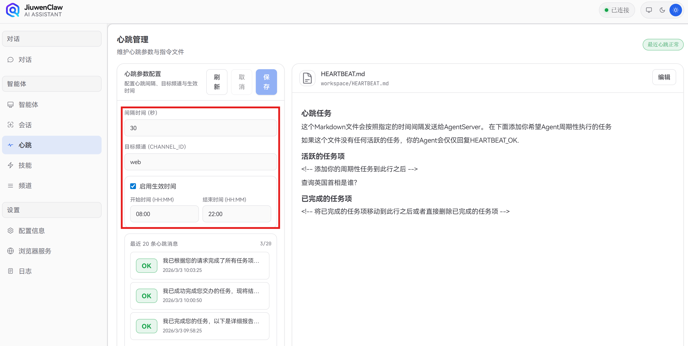
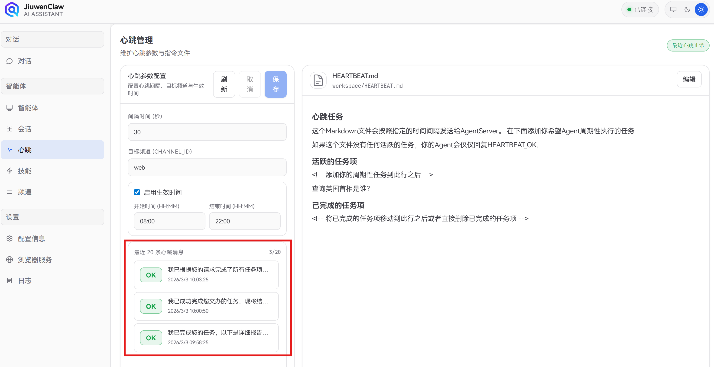
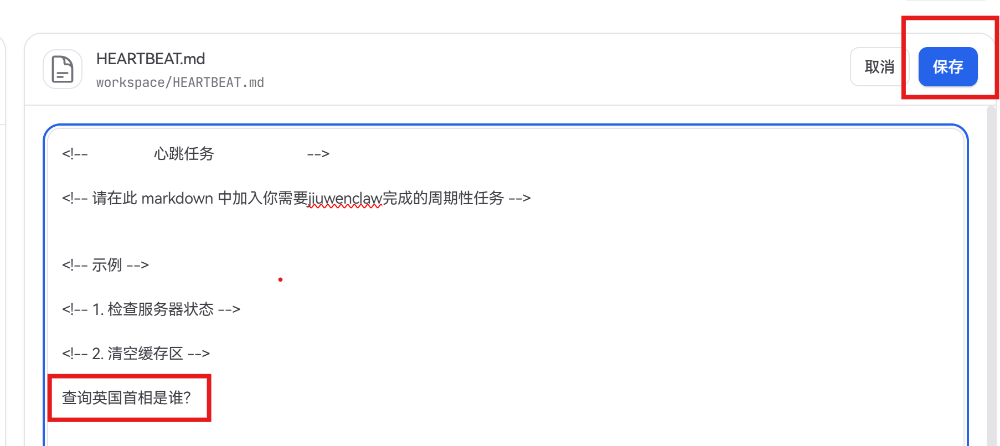
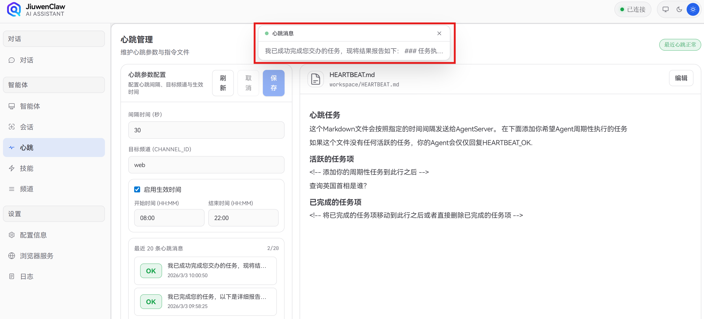

# Heartbeat

**Heartbeat** is a periodic probe from the gateway to AgentServer to verify connectivity and agent health. If **`workspace/HEARTBEAT.md`** (under the agent workspace) is configured, the agent can also run listed tasks on each beat. You can choose which channel receives results (default: web).

---

## 1. Overview

- **Liveness**: Sends on a fixed interval to confirm the service is up.
- **Optional tasks**: If `HEARTBEAT.md` exists under the workspace, the agent runs “active task items” in order and writes results back; otherwise the response is `HEARTBEAT_OK`.
- **Relay**: Heartbeat responses can be forwarded to a configured channel (e.g. web) for UI display.

---

## 2. Configuration

Three ways: config file, environment variables, or the web UI.

### 2.1 `config/config.yaml`

```yaml
heartbeat:
  # Interval in seconds, default 3600
  every: 3600
  # Relay target channel (e.g. "web" for the web UI)
  target: web
  # Active window in local time; omit for 24/7
  active_hours:
    start: 08:00
    end: 22:00
```


| Field | Meaning | Notes |
| ----- | ------- | ----- |
| `every` | Interval (seconds) | Must be &gt; 0. `60` = every minute, `3600` = hourly. |
| `target` | Relay channel | Often `web` to push to the web client; empty = no relay. |
| `active_hours` | Time window | `start` / `end` as `HH:MM` (24h). Heartbeat only fires when local time is in `[start, end]`. Omit for always on. Supports windows past midnight (e.g. 22:00–06:00). |


### 2.2 Environment variables (override YAML)


| Variable | Meaning | Example |
| -------- | ------- | ------- |
| `HEARTBEAT_INTERVAL` | Interval (seconds) | `3600` |
| `HEARTBEAT_RELAY_CHANNEL_ID` | Relay channel | `web` |
| `HEARTBEAT_TIMEOUT` | Single heartbeat timeout (seconds) | `30` |


Env vars override the `heartbeat` section in `config/config.yaml`.

### 2.3 Web UI — Heartbeat panel

Open **Heartbeat** in the sidebar to:

- View current interval, relay target, and active window  

- Edit and save (writes `config.yaml` and restarts the heartbeat service)  

- See the last 20 heartbeat messages (status, body, time)  


---

## 3. `HEARTBEAT.md` and periodic tasks

### 3.1 Location and role

- **Path**: `workspace/HEARTBEAT.md` at the workspace root (same file as in the UI; you can click **Edit** in the panel).  

- **Role**: If the file exists and lists tasks, each heartbeat run parses and executes them; otherwise only `HEARTBEAT_OK` is returned.

### 3.2 Agent behavior

- Each heartbeat includes instructions to read active items from `HEARTBEAT.md` and complete them; otherwise reply `HEARTBEAT_OK`.
- The server reads `workspace/HEARTBEAT.md`, builds a chat request, and runs the normal flow; on empty/parse failure, returns `HEARTBEAT_OK`.

---

## 4. Web UI and events

- **Status**: The heartbeat panel/toolbar shows last status (“OK” / alert), last body, and time.
- **Events**: When `target` is `web`, responses are pushed via `heartbeat.relay`; non-`HEARTBEAT_OK` content may trigger a popup.  


---

## 5. FAQ

**Q: I edited `heartbeat` in `config.yaml` but nothing changed.**  
A: Config is read at startup. If you use the web panel, it rewrites YAML and restarts the heartbeat service. If you edit YAML by hand, restart the app (e.g. `jiuwenclaw-web`).

**Q: Heartbeats only during work hours?**  
A: Set `heartbeat.active_hours.start` / `end`, e.g. `09:00`–`18:00`.

**Q: Heartbeat timeout?**  
A: Set `HEARTBEAT_TIMEOUT` (seconds). On timeout the beat is marked failed and a WARNING is logged.

**Q: Where must `HEARTBEAT.md` live?**  
A: At the workspace root: `workspace/HEARTBEAT.md`, aligned with the agent workspace. Otherwise it is treated as no custom tasks.

---

## 6. Code index

- Service: `jiuwenclaw/gateway/heartbeat.py` (`GatewayHeartbeatService`, `HeartbeatConfig`).
- Config: `config/config.py` (`update_heartbeat_in_config`); `app.py` builds `HeartbeatConfig` from YAML + env.
- Agent: `jiuwenclaw/agentserver/interface.py` reads `workspace/HEARTBEAT.md` when `request.params` indicates heartbeat.
- Web: `jiuwenclaw/web/src/components/HeartbeatPanel/`, `heartbeat.get_conf` / `heartbeat.set_conf`, `heartbeat.relay`.
