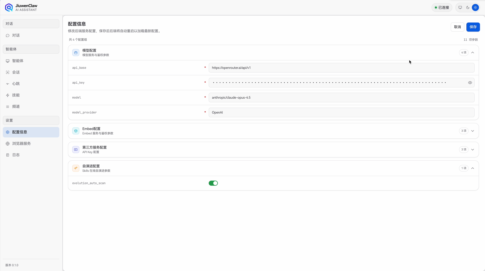
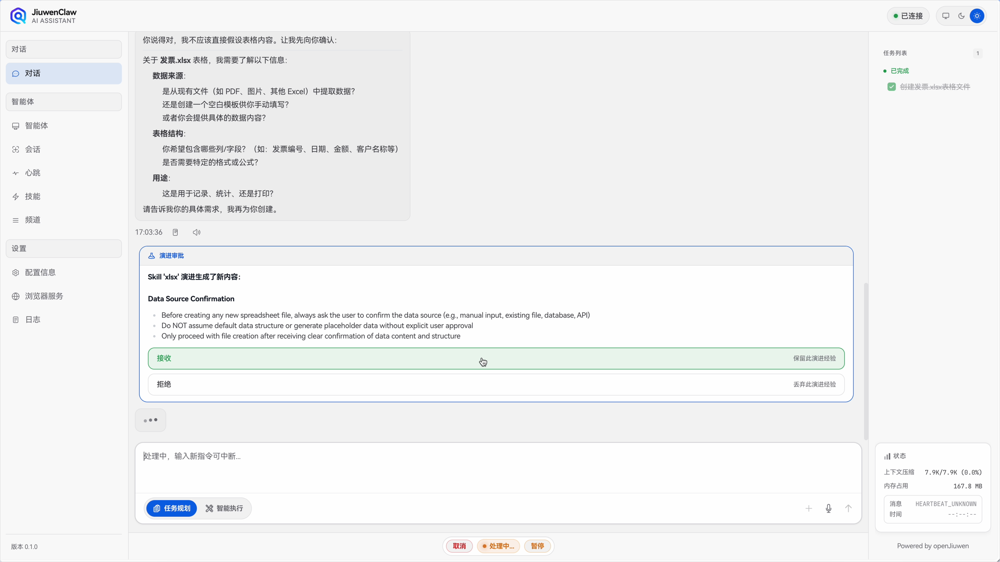
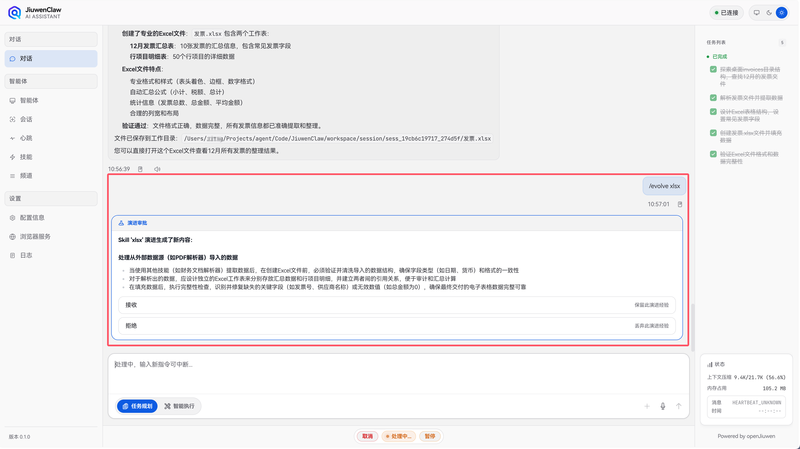
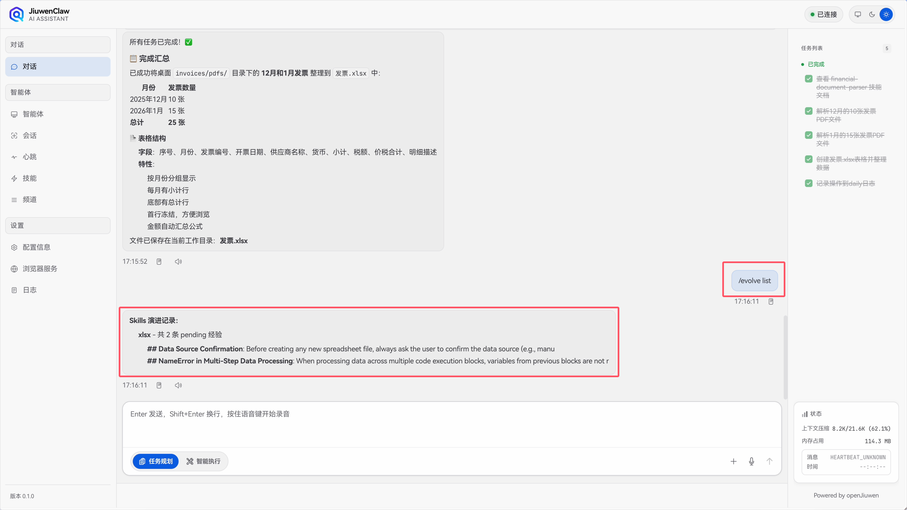

# Skill self-evolution

Most agents **freeze** skills after deployment: tool errors become log lines; user corrections do not change behavior. JiuwenClaw uses the **openJiuwen evolution stack** with **`SkillCallOperator`** to unify skill reads/writes and evolution, plus **signal detection** that turns failures and user corrections into updates stored in **`evolutions.json`** and merged back into **`SKILL.md`** when appropriate.

## Core components

### SkillCallOperator

Central entry for skills: read `SKILL.md`, run skill logic, load accumulated evolution notes. When improvements are detected, they go to `evolutions.json` and are merged on the next skill call so the agent always sees the latest guidance.

### SkillOptimizer

Drives evolution: receives signals from `SignalDetector`, decides if they matter, calls the LLM for concrete changes, and writes evolution records. **`/evolve`** invokes this path.

### SkillEvolutionManager

Orchestrates scanning, LLM-generated records, `evolutions.json` I/O, and optional **solidify** into `SKILL.md`. Connects `SignalDetector`, `SkillOptimizer`, and `SkillCallOperator`.

### SignalDetector

Rule-based (no LLM): watches tool results for error patterns and user phrases that look like corrections, and attributes signals to the active skill.

---

## What counts as a signal?

### Execution failures

Timeouts, HTTP errors, exceptions, etc. Keywords include: `error`, `exception`, `failed`, `failure`, `timeout`, `connection error`, `econnrefused`, `enoent`, `permission denied`, `command not found`, and similar.

### User corrections

Phrases like “wrong”, “should be”, “not that”, or English: `that's wrong`, `should be`, `actually`—treated as negative feedback for the current skill.

---

## What happens after a signal?

### Failure → troubleshooting notes

Failure context is turned into actionable bullets under **Troubleshooting** (or similar) in the skill doc.

```text
Raw:
Tool 'weather-check' returned: Error: API timeout after 30s

Evolved:
## Troubleshooting
- On weather API timeout, check network first; consider retries or a fallback.
```

### Correction → examples

User corrections become **Examples** so the next run matches real intent.

```text
Raw:
User: No—I meant Shanghai, not Beijing

Evolved:
## Examples
- For "Shanghai weather" use Shanghai coordinates, not the default Beijing.
```

---

## Evolution flow

```text
User chat / tool run
        │
        ▼
┌───────────────────┐
│  SignalDetector   │
└────────┬──────────┘
         ▼
┌─────────────────────────────┐
│    SkillEvolutionManager    │  .scan()
└────────────┬────────────────┘
             ▼
┌─────────────────────────────┐
│    SkillEvolutionManager    │  .generate()
└────────────┬────────────────┘
             ▼
┌─────────────────────────────┐
│      evolutions.json        │
└────────────┬────────────────┘
             ▼ (optional)
┌─────────────────────────────┐
│         .solidify()         │  merge into SKILL.md
└─────────────────────────────┘
```

---

## Evolution file

Per-skill `evolutions.json`:

```json
{
  "skill_id": "<skill_name>",
  "version": "1.0.0",
  "updated_at": "2024-01-15T10:30:00Z",
  "entries": [
    {
      "id": "ev_1234abcd",
      "source": "execution_failure",
      "timestamp": "2024-01-15T10:30:00Z",
      "context": "API timeout after 30s",
      "change": {
        "section": "Troubleshooting",
        "action": "append",
        "content": "## FAQ\n- On API timeout..."
      },
      "applied": false
    }
  ]
}
```

`applied: false` = pending solidify; `applied: true` = merged into `SKILL.md`.

---

## Effect

Skills stay **living documents**: risks, examples, and fixes accumulate from real use. On the next skill load, `evolutions.json` is merged so behavior improves without manual editing.

---

## How to use

### Enable auto-evolution

Turn on **`evolution_auto_scan`** in configuration (see [Configuration](Configuration.md)).



### Automatic path

After each tool run / turn, signals may append entries to `evolutions.json` in the background. No user action required.



### Manual evolution

```bash
/evolve <skill_name>
```

Example:

```bash
/evolve xlsx
```



### List pending

```bash
/evolve list
```



### Manage `evolutions.json`

Location:

```
~/.jiuwenclaw/workspace/agent/skills/<skill_name>/
├── SKILL.md
├── evolutions.json
└── ...
```

You can edit entries directly: add/remove objects, set `applied: true` when merged.

```json
{
  "entries": [
    {
      "id": "ev_1cdbc3a5",
      "source": "execution_failure",
      "timestamp": "2026-03-09T09:33:08Z",
      "context": "Error context",
      "change": {
        "section": "Troubleshooting",
        "action": "append",
        "content": "Evolved content",
        "relevant": true
      },
      "applied": false
    }
  ]
}
```
