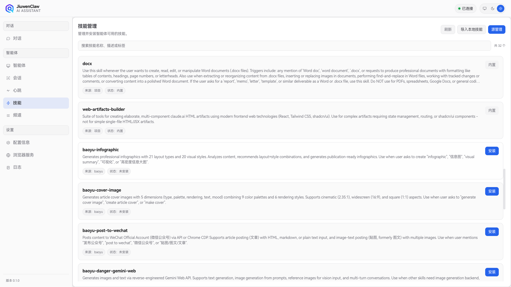
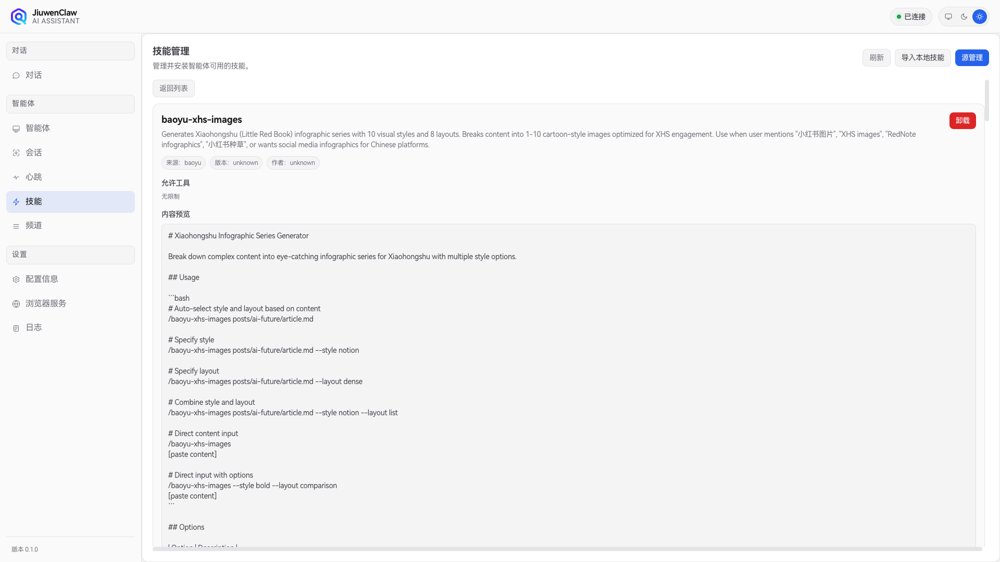
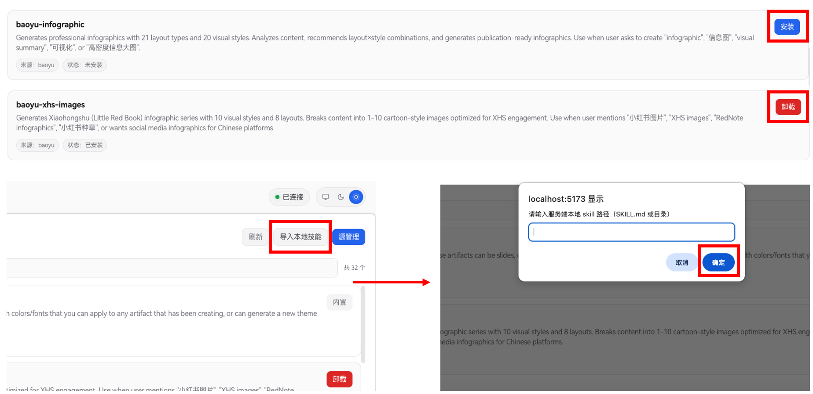

# Skills

JiuwenClaw’s **Skills** system lets you extend the agent with new capabilities, tool permissions, and extra system prompt content. Use the **Skills** panel in the web UI and the backend `SkillManager` to install, remove, import, and manage skills from multiple sources.

## 1. Skill sources

- **Project / built-in**: Bundled with the repo or project defaults.
- **Local**: Imported from a path on disk (absolute or relative).
- **Marketplace**: Downloaded from configured third-party Git repos.
- **SkillNet**: Search and one-click install from [SkillNet](https://github.com/zjunlp/SkillNet); uses the GitHub API. Without a token, anonymous rate limits apply (~60/hour). Configure **`github_token`** (`GITHUB_TOKEN`) under **Configuration → Third-party** (`skillnet-ai>=0.0.14`).
- **ClawHub**: Search and one-click install from [ClawHub](https://clawhub.ai/).

## 2. Skills panel (web UI)

- **List & search**: Shows installed and available marketplace skills; filter by name, description, author, or tags.



- **Details**: Click a skill for metadata, install state, version, author, **allowed tools**, and `SKILL.md` preview.



- **Lifecycle**: **Install** marketplace skills, **uninstall**, or **import** a local `SKILL.md` path or folder into the workspace.



- **Sources**: **Add** a marketplace Git URL (disabled by default), **enable** to fetch the catalog, **disable** to hide without deleting cache, **delete** to remove the source and its cache.


## 3. Backend behavior

Implementation: `jiuwenclaw/agentserver/skill_manager.py`.

### 3.1 Storage

- **`workspace/agent/skills/`**: Active skills, one folder each.
- **`workspace/agent/skills/_marketplace/`**: Cloned marketplace repos (cache).

### 3.2 State file

**`workspace/skills_state.json`** stores marketplace sources, install records (name, market, version, commit, time), and local imports.

### 3.3 Logic

- Git **clone/pull** for marketplace sync.
- Parses **`SKILL.md`** YAML frontmatter (`name`, `description`, `allowed_tools`, …); falls back to folder/file name if missing.
- **Name conflicts** are blocked unless **force** overwrite is used.

## 4. Authoring a skill

A skill is centered on **`SKILL.md`**. Recommended structure with frontmatter:

```markdown
---
name: my-custom-skill
version: 1.0.0
author: your-name
description: Example custom agent skill
tags: [demo, tools]
allowed_tools: [webSearch, readFile]
---

# Skill body / agent instructions

Describe capabilities, background, or workflows here.
When `allowed_tools` is set, the agent receives those tools when this skill is loaded.
```

**Fields**

- **`name`**: Unique id (required; filename used if omitted).
- **`allowed_tools`**: Tool names to enable for this skill.
- **Body**: Woven into the agent’s prompt at runtime.

---

## 5. How skills installed via SkillNet are used in Claw

SkillNet installs behave like local/marketplace installs.

1. **On disk**  
   Copied to **`workspace/agent/skills/<skill-name>/`** with at least `SKILL.md` (`SkillManager.handle_skills_skillnet_install`).

2. **Agent load**  
   On create/reload, `interface.py` calls `register_skill(str(_SKILLS_DIR))` so `SkillUtil` scans subfolders (skips `_` prefixes), parses each `SKILL.md`, and feeds `get_skill_prompt()`.

3. **Runtime**  
   The system prompt includes a **Skills** section (`react_agent.py` `_get_skill_messages()`): list names/descriptions and instruct the model to **read the skill with `view_file`** before tasks. Path relative to agent workspace: **`skills/<skill-name>/SKILL.md`**.

4. **Evolution**  
   `SkillCallOperator` / `SkillOptimizer` use the same `_SKILLS_DIR`, so SkillNet skills participate in evolution like any other.

**Summary**: If `workspace/agent/skills/<name>/SKILL.md` exists, the skill appears after the next agent reload; the model uses `view_file("skills/<name>/SKILL.md")` to follow the workflow.

## 6. Using ClawHub

ClawHub is an online platform for sharing and discovering skills. You can search and install community-contributed skills.

### 6.1 How to use

1. **Get Token**
Login to [https://clawhub.ai/](https://clawhub.ai/) and obtain your access token.

2. **Search and Install**
In the **Skills** panel, click the **ClawHub Online Search** button:
- Enter your token when prompted for first-time use
- Search for skills by keyword
- One-click install skills to the local workspace

ClawHub installs behave like local/marketplace/SkillNet installs and are treated identically in the system.
