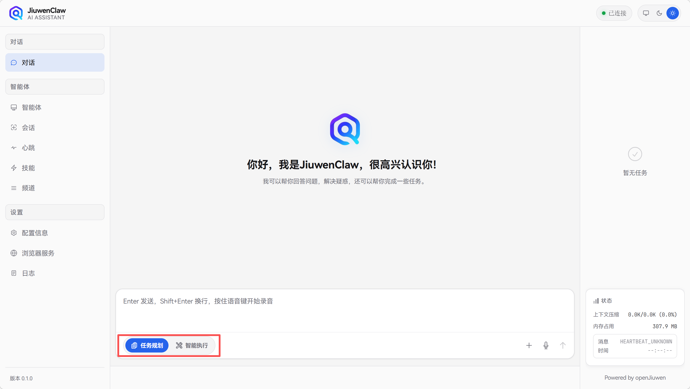

# 任务规划：让智能体从容应对复杂变局

在人工智能应用日益复杂的今天，如何让智能体在处理长序列任务时保持目标清晰、执行有序，已成为提升人机协作效率的核心命题。试想这样一个典型场景：**智能体正在协助用户处理12月的发票，此时用户突然想起1月的发票也需要处理，并希望将两份合并后统一发送一封通知邮件。用户期望的是能够动态打断当前流程，基于新需求插入1月发票任务，而不是让新任务在队列中排队等待重复执行。**

为应对这类瞬息万变的动态需求，JiuwenClaw 引入了**任务规划模式**。它通过一套体系化的待办事项工具，赋予智能体结构化的任务拆解与动态管理能力，使其从“单线执行者”蜕变为“灵活的协作者”。

[演示视频](../assets/videos/todo.mp4)

## 核心机制：动态任务拆解与实时响应

该模式的核心逻辑在于：当用户提出模糊或复杂的请求时，智能体会自动将其解析为一系列可执行的子任务，并通过内置的待办工具进行系统性记录。在执行过程中，每完成一个子任务，智能体都会实时更新其状态，确保任务进度始终清晰可控。

更为关键的是，JiuwenClaw 支持**用户的动态干预**——无论是追加新需求，还是在现有任务序列中插入紧急事项，系统均可借助 **openJiuwen 的智能体中断恢复与任务调度能力**进行灵活响应，确保整体任务流的连贯性与可控性，让用户始终掌握主导权。

## 工具赋能：一套完整的待办事项工具包

JiuwenClaw 提供了一套覆盖任务管理全流程的工具包（`TodoToolkit`），任务以 Markdown 形式持久化至 `workspace/session/{session_id}/todo.md`，按会话隔离，支持并发安全读写。

### 工具一览

| 工具 | 说明 |
| :--- | :--- |
| `todo_create` | 创建初始待办清单。**注意**：若该会话已有 todo 列表则调用失败，需改用 `todo_insert` 追加任务 |
| `todo_insert` | 在指定索引位置插入新任务，已有任务自动后移。若 todo 列表不存在，则自动创建 |
| `todo_complete` | 标记任务为已完成，可附带简要结果（`result`） |
| `todo_remove` | 删除指定任务，剩余任务自动重新编号 |
| `todo_list` | 列出当前所有待办事项及状态 |

### 任务状态

| 状态 | 说明 |
| :--- | :--- |
| `waiting` | 待执行 |
| `running` | 执行中 |
| `completed` | 已完成 |
| `cancelled` | 已取消 |

### 典型流程

1. 用户提出复杂需求 → 智能体调用 `todo_create` 拆解为子任务
2. 用户中途插入新需求 → 智能体调用 `todo_insert` 在合适位置插入
3. 完成某子任务 → 调用 `todo_complete` 并填写结果
4. 取消或作废某任务 → 调用 `todo_remove`
5. 随时调用 `todo_list` 掌握全局进度

借助这套工具，JiuwenClaw 有效解决了智能体在处理长周期、多步骤任务时常见的**目标丢失与执行断层问题**，让人机协作更加顺畅、高效。无论是日常事务管理，还是复杂业务流程的自动化推进，JiuwenClaw 的任务规划模式都将成为您不可或缺的智能助手。

用户可以在对话页面自行选择是否开启任务规划能力，当前聊天会默认开启任务规划，若关闭，则变更为经典的ReAct执行模式。
