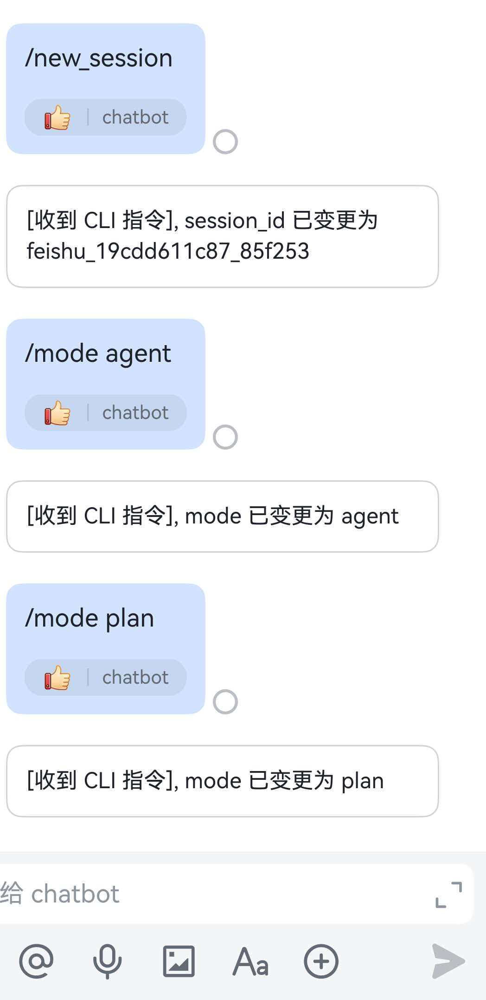

## 命令行 / 通道控制指令说明

JiuwenClaw 支持通过「特殊前缀指令」控制会话和模式，最常用的是：

- `/new_session`：为当前通道切换到一个全新的 `session_id`
- `/mode plan`、`/mode fast` 或 `/mode team`：切换当前通道的工作模式

这些指令由 Gateway 层的 `MessageHandler` 解析，**不会发给 Agent 本身**。

---

### 1. `/new_session` —— 新建会话 ID

**作用：**

- 针对受控通道（当前支持：`feishu` / `xiaoyi` / `dingtalk`），为该通道生成一个新的 `session_id`，形如：  
  - `feishu_<毫秒时间戳hex>_<随机hex>`
  - `xiaoyi_<毫秒时间戳hex>_<随机hex>`
  - `dingtalk_<毫秒时间戳hex>_<随机hex>`
- 后续从该通道进来的所有普通聊天消息，都会被强制覆盖为这个新的 `session_id`，从而在 `workspace/session/` 下形成一个新的会话目录。

**使用方式：**

- 在通道（飞书 / 小艺 / 钉钉）中，直接发送一条消息：

  ```text
  /new_session
  ```


- Gateway 会：
  1. 拦截这条消息（不转发给 Agent）
  2. 为该 `channel_id` 生成新的 `session_id`
  3. 在当前会话里回复一条系统提示，例如：  
     `session_id 已变更为 feishu_17f2b4b32e0_ab12cd`

**注意事项：**

- `/new_session` 只会修改 **后续消息绑定的 session_id**，不会立刻创建目录；目录在真正用到（如 todo / 文件写入 / 显式创建 session）时按需生成。

---

### 2. `/mode` —— 切换通道模式（plan / fast / team）

**作用：**

- 为当前通道设置一个逻辑「模式」，用于告诉 Agent 是偏向：
  - `plan`：偏规划、解释、拆解任务（默认）
  - `fast`：偏自动执行、直接动手（内部与历史 `agent` 模式一致）
  - `team`：组队模式
- 模式信息会写入消息的 `params["mode"]` 中，Agent 在构造提示词和行为策略时可以使用。

**使用方式：**

- 在受控通道中发送：

  ```text
  /mode plan
  ```

  或

  ```text
  /mode fast
  ```

- Gateway 会：
  1. 识别这条消息为控制指令，不转发给 Agent
  2. 更新内部 `ChannelControlState.mode`
  3. 给当前会话回复一条系统提示，例如：  
     `mode 已变更为 fast`

**生效范围：**

- 模式是 **按通道维度** 存储的（`channel_id` → `mode`），同一通道的所有后续消息，都会自动带上当前模式。
- 前端 `config.yaml` 中的 `default_mode` 可设初始值，`MessageHandler` 启动时会读取。


