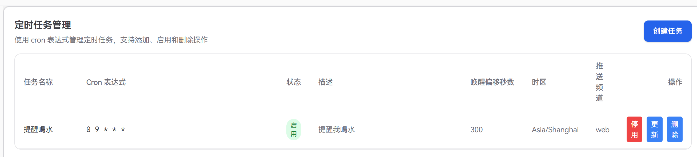
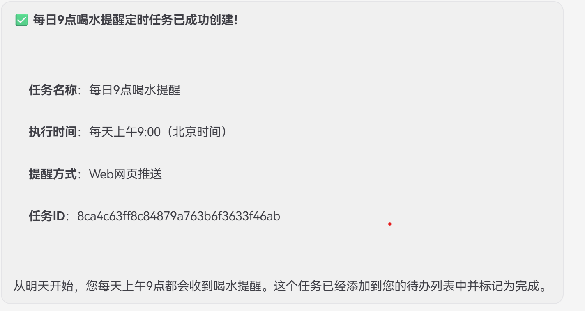

## 定时任务（Cron）快速上手

本文介绍如何在 JiuwenClaw 中创建和管理一个最简单的定时任务，并让它按固定时间把结果推送到指定频道（如 Web、飞书）。

---

### 1. 定时任务能做什么？

- **定时执行一句话指令**：例如“每天早上 9 点汇总昨天的待办完成情况”。
- **让 Agent 自己去跑任务**：定时跑搜索、生成日报等。
- **多通道推送**：结果可以推到 Web 或 飞书 频道（使用飞书频道需要设置chat_id， 详情见飞书配置文档）。

---

### 2. 在 Web 面板创建一个最简单的定时任务

1. 打开 Web 界面，进入 **「定时任务 / Cron」** 面板。
2. 点击 **「新建任务」**，按下表填写：

   - **name（任务名称）**：例如 `daily_todo_summary`  
   - **cron_expr（Cron 表达式）**：  
     - 每天早上 9:00：`0 9 * * *`  
     - 每小时第 15 分钟：`15 * * * *`
   - **timezone（时区）**：一般用 `Asia/Shanghai`
   - **targets（推送频道）**：从下拉中选择：
     - `web`：推到 Web 面板
     - `feishu`：推到飞书通道
   - **enabled（是否启用）**：勾选（`true`）
   - **description（任务内容）**：一句自然语言，描述到点时要让 Agent 做什么，例如：  
     `生成一段简短的中文文本，说明当前时间点的健康打卡提醒。`
   - **wake_offset_seconds（提前秒数，可选）**：默认 60，表示提前 1 分钟唤醒 Agent 做准备。

3. 保存后，任务会写入 `~/.jiuwenclaw/workspace/cron_jobs.json`，调度器自动生效。

---

### 3. 常见 Cron 表达式示例

- **每天 9:00**：`0 9 * * *`
- **每天 18:30**：`30 18 * * *`
- **每周一 9:00**：`0 9 * * 1`
- **每小时整点**：`0 * * * *`

Cron 表达式格式为：  
`分 时 日 月 周`（5 段，空格分隔）
或者
`分 时 日 月 周 秒 年`（7 段，空格分隔）

---

### 4. 在聊天中通过工具创建任务（可选）

当 Agent 具备 `cron_create_job` 工具能力时，你也可以直接在聊天中说：

> “帮我创建一个定时任务，每天 9 点在 Web 上提醒我喝水。”

Agent 会自动解析出 `cron_expr` / `description` / `targets` 等字段，并调用 `cron_create_job` 创建任务，等价于在前端面板上点“新建任务”并填写表单。

